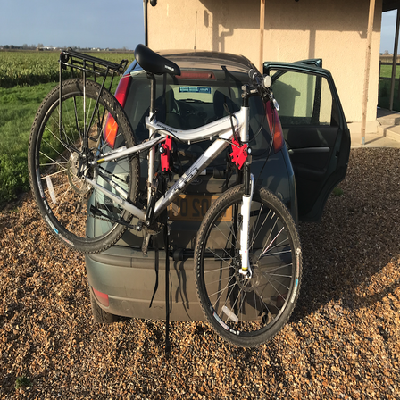

# YOLOv1

A technical article and PyTorch Implementation of the popular [YOLO object detection algorithm](https://pjreddie.com/darknet/yolov1/) by Joseph Redmon. Follow this link for the technical article available online at [AraIntelligence.com](https://araintelligence.com/blogs/deep-learning/object-detection/yolo_v1/) which provides an in-depth explanation about the algorithm.

# PIP Requirements
The python version used for development is Python 3.6.10 and the libraries used are located in `requirements.txt`. Highlighted below are the most important ones

* numpy==1.18.1
* Pillow==7.0.0
* torch==1.5.0
* torchvision==0.6.0
* torchviz==0.0.1

# Training
The model was trained on the Pascal VOC 2007+2012 dataset which was partitioned into a training set of 13,170 images and a validation set of 8,333 images.
There are some helper scripts available:

* `./data/download_voc.sh` : Downloads the VOC dataset from Joseph Redmon's VOC mirror and partitions the dataset into a training and validation one
* `python training.py` : is the script used to train the model

The model achieves a relatively low training loss on the dataset. The validation loss is lower than the training loss due to the data augmentation applied to the train dataset during training.

## Image Augmentation
<!-- TODO: Show the ground truth detections on the augmentations -->
Sample augmentations applied are shown below

### Color Jitter

### Random Blur

### Random Horizontal Flip

### Random Vertical Flip

### Random Erasing

# Inference 
## Inference speed 

| Device | Backbone | Input Size | Time (seconds) |
| --- | --- | --- | --- |
| 2.9 GHz Dual-Core Intel Core i5 | ResNet50 | 448x448 | 2s |
| NVIDIA Tesla K80 GPU | ResNet50 | 448x448 | - |

## Prediction
* Image File on disk: `python detect_image --image="./data/car_bike.png" --model="./model_checkpoints/90_epoch.pth"`
* Video file on disk: `python detect_image --video="./data/IMG_4855.mov" --model="./model_checkpoints/90_epoch.pth" --output="./processed_IMG_4855.mov"`

<!-- TODO: ## Pretrained weights -->
